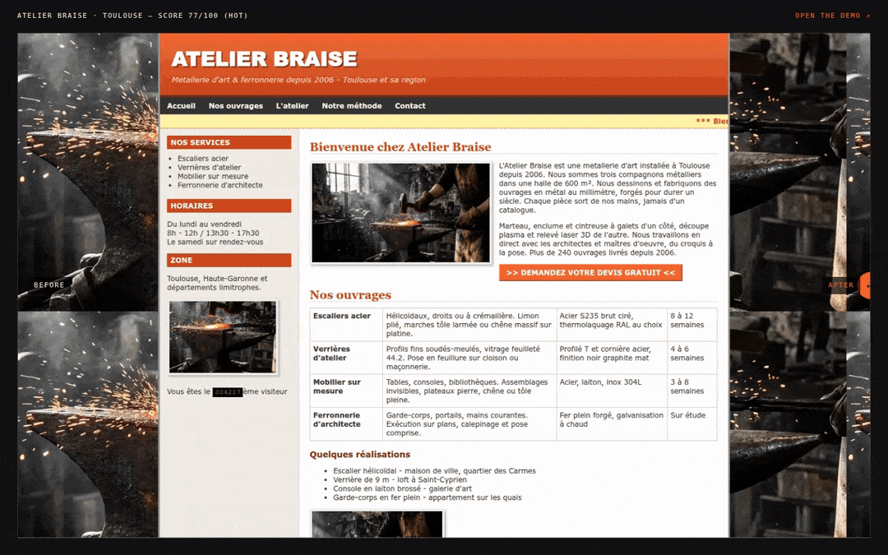
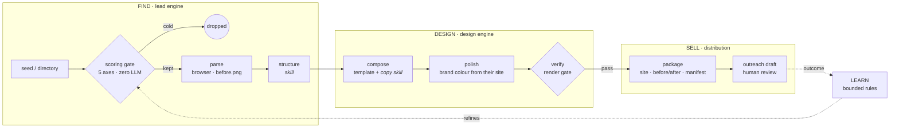
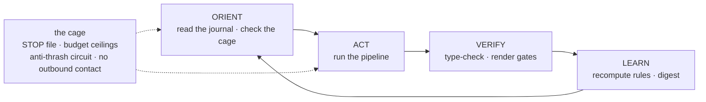
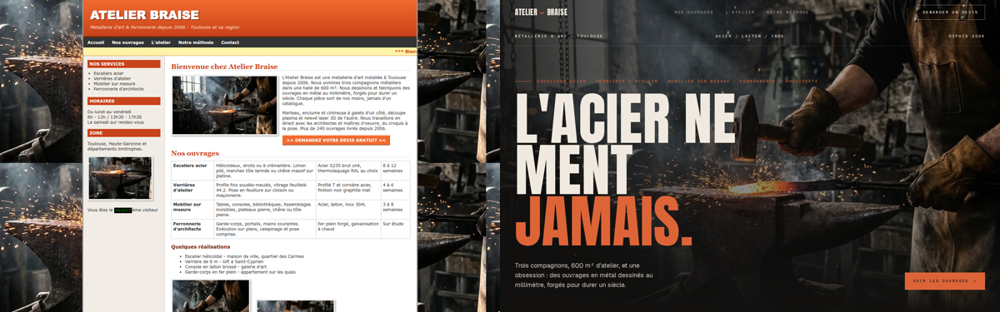
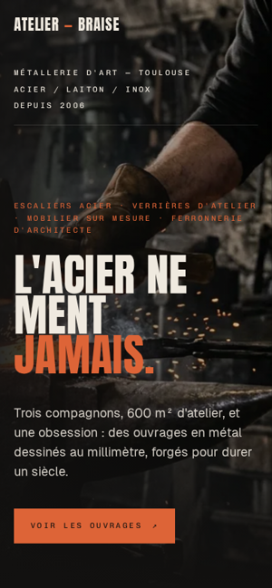

<p align="center">
  
</p>

<h1 align="center">LastWebStudios</h1>

<p align="center"><b>An autonomous web-design agency: it finds businesses with a weak website, rebuilds their site from their own content, and pitches with the finished result.</b></p>

<p align="center">
  
  
  
  
  
</p>

The demo **is** the pitch: instead of sending a proposal, the atelier sends a site that already exists.
This repository is the public, runnable core of the system, **GENESIS**, which runs that loop on its own
and gets a little better at it every cycle.

## What it does

- **Finds** the right prospects cheaply. A five-axis scoring gate (need, leverage, value, reachability,
  expansion) reads the raw HTML with no LLM and drops polished sites before anything expensive runs.
- **Reads** the current site in a real browser: a full-page "before" screenshot, photos, the real menu
  labels and headings. Then a skill turns the free text into a structured `ProspectSheet`.
- **Designs** a demo from the prospect's own facts. Nothing is invented. The brand colour is sampled
  from their old site, and a render gate checks the result before anything leaves the atelier.
- **Packages** the pitch: the portable site, a before/after slider page and a manifest. Outreach is
  drafted for a human to send. The system never contacts anyone by itself.
- **Learns** from outcomes. Replies, meetings and signed deals recalibrate the scoring through bounded,
  small-sample-safe rules, so the human has to correct it less and less.

## How it works



Every block does one job and talks to the others **only through files in `data/`**, so any step can be
replaced or re-run on its own. One rule sorts the code: a **skill** costs an LLM call (`skills/*/prompt.md`),
a **script** is deterministic and free. The cheap filter runs first, and the browser and the model only
run on prospects that survived the gate. A single orchestrator (`architecture/`) owns the order of the steps.

### GENESIS, the unattended loop



A scheduler fires `npm run cycle` every few hours. The repo is the loop's only memory
(`journal/metrics.md`, `journal/run-log.md`). The **cage** keeps it safe: a `STOP` file halts it between two
prospects, lifetime/day/cycle spending ceilings are enforced before every model call, and the same failure
twice in a row opens a circuit instead of burning budget. More in [docs/ARCHITECTURE.md](docs/ARCHITECTURE.md).

<p align="center">
  
  &nbsp;
  
</p>

## Stack

TypeScript on Node (run with `tsx`, checked with `tsc`), Playwright for everything that needs a real browser
(parsing, colour sampling, render gate), plain `fetch` for the scoring probe, and Node's built-in test
runner. The LLM layer is provider-agnostic: any OpenAI-compatible `/chat/completions` endpoint, with the
model chosen per task class (`mechanical`, `extract`, `design`, `strategy`) in `.env`. The demo template is
dependency-free HTML/CSS/JS with open fonts (Anton, Geist, Chivo Mono, all under the OFL).

## Run it locally

```bash
npm ci
npm run setup      # downloads the headless Chromium used by Playwright
npm run demo       # the full pipeline on 3 fictional prospects, offline, 10–20 s
npm run preview    # → http://127.0.0.1:4173/atelier-braise-toulouse/  (before/after + the demo)
```

No key needed: without `LLM_API_KEY`, the two skills are answered from recorded replays in `demo/replay/`.
The demo shows the whole funnel: one dated site is rebuilt, one modern site is dropped at the gate, and one
dead site is kept for a manual build.

```bash
npm test                                     # scoring model, learning loop, cage, template engine
npm run learn -- demo/outcomes.sample.jsonl  # recompute scoring rules from sample outcomes
npm run cycle -- --demo                      # one unattended cycle: orient → act → verify → learn
touch STOP && npm run cycle -- --demo        # the kill switch, in action
```

To run the skills live, copy `.env.example` to `.env` and set `LLM_BASE_URL`, `LLM_API_KEY`, `LLM_MODEL`,
your prices per million tokens and your budget ceilings.

## Project structure

```
architecture/   orchestration/run.ts (the funnel) · cycle/cycle.ts (the unattended loop)
leadengine/     2_scoring (probe + 5-axis model) · 3_parsing (browser parse + structure)
design/         templates/atelier · scripts: compose · polish · verify · industries/ · routing.json
distribution/   scripts/package.ts: site + before/after page + manifest
learning/       record outcomes → buildRules() → rules.json, read by the scoring
packages/       shared/prospect.ts (the contract) · utils: llm, route, meter, guard, journal
skills/         structuration · copywriter (condensed public prompts)
demo/           fictional fixtures, seed, recorded skill answers, sample outcomes
test/           node:test suites
```

The private build goes further: a directory scraper, a visual judge in the gate, a design catalog built from
reference sites that feeds a bespoke composer, a blind before/after beauty gate, a review station where
human comments are applied and then distilled into rules, and a library of skills the loop maintains
itself. Those parts, the production prompts and all real prospect data stay private.

## Credits

Built by **Scarville** ([@Sc4rville](https://github.com/Sc4rville)) and **Koussaïla**
([@kabylesystem](https://github.com/kabylesystem)), co-founders of LastWebStudios. Koussaïla leads the
technology on the lead-engine side: sourcing, scoring and prospect data.

All businesses in `demo/` are fictional. Demo photography is an AI-generated visual from the LastWebStudios
showcase. Fonts are © their authors under the SIL Open Font License (see `design/templates/atelier/fonts/`).

## License

[MIT](LICENSE) © Scarville
