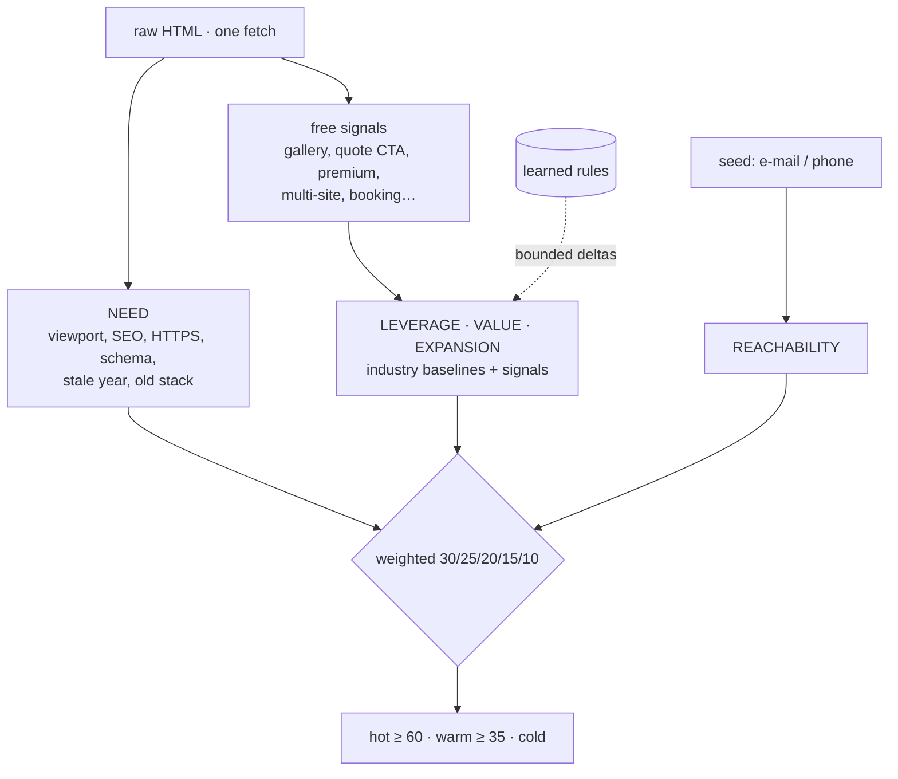
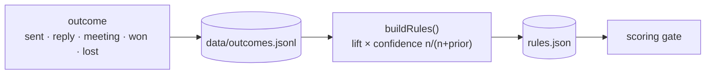

# Architecture

LastWebStudios is a small agency run as a pipeline. GENESIS is that pipeline running unattended, with
guardrails, and improving itself from feedback. This page explains the parts that are public in this repository.

## Four verbs, one bus

| verb | block | job | talks to |
|---|---|---|---|
| **FIND** | `leadengine/` | score the opportunity, read the site, write the `ProspectSheet` | `data/raw`, `data/prospects` |
| **DESIGN** | `design/` | compose the demo from the sheet, apply the brand, pass the render gate | `output/sites` |
| **SELL** | `distribution/` | package the demo and the before/after page. Outreach is drafted, never sent | `distribution/packages` |
| **LEARN** | `learning/` | turn field outcomes into bounded scoring rules | `learning/rules` |

Blocks never import each other's steps. They read and write files. `architecture/` is the only code that
knows the order of the steps. The one documented exception is `learning/ → scoring`: the scoring reads the
rules and never writes them.

**The contract**, `packages/shared/prospect.ts`, is the only type the lead engine and the design engine
share. Everything factual on a demo comes from it, which means it comes from the prospect's own site.

## Skill vs script

| nature | what | where | costs an LLM call |
|---|---|---|:---:|
| skill | judgement or generation | `skills/<name>/prompt.md`, run by `packages/utils/llm.ts` | yes |
| script | deterministic mechanics | `*/scripts/*.ts` | no |
| orchestration | the order of the steps | `architecture/` | – |

Each LLM call declares a task class (`mechanical`, `extract`, `design`, `strategy`). The operator maps
classes to models in `.env`, which gives a single dial for cost against quality.

## The scoring gate

The need floor depends on value: a high-value trade justifies chasing a more moderate need. Nobody to reach
means never "hot", and too little material means "kept for a manual build", never auto-built.

## The learning loop

- **Small-sample shrinkage**: two anecdotes move almost nothing. It takes volume to shift a baseline.
- **Tight bounds**: an industry value moves by at most ±15, and a signal multiplier stays within 0.5–1.5.
- **Safe by default**: a missing or corrupted rules file gives `{}`, which means pure human baselines.

In the private build, a second loop turns human design corrections (review comments on generated sites)
into rules, design mantras and new skills. That is what GENESIS calls *injected human abstraction*: the human
states a correction once, and the machinery stores it so it does not need to be said again.

## The cage

| guardrail | where | behaviour |
|---|---|---|
| kill switch | `guard.ts` | a `STOP` file at the root halts the run between two prospects |
| budget | `meter.ts` | lifetime → day → cycle ceilings checked before every model call |
| anti-thrash | `guard.ts` | the same failure twice in a row opens the circuit |
| verification | `verify.ts`, `cycle.ts` | render gate on every site, type-check on every cycle |
| reach | by design | no code path sends a message: outreach is a draft for a human |
